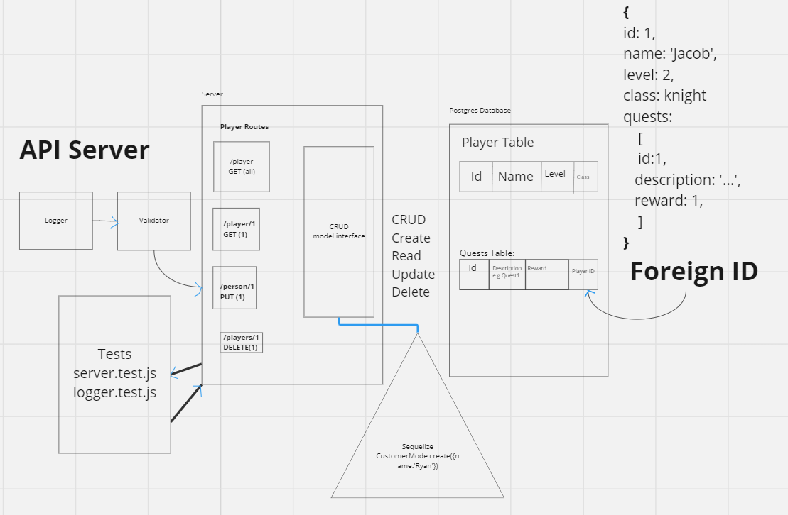

# LAB - Class 04

## Project: API Server
Using the frame work of an RPG, this API server is meant to showcase how to create and interact with "players" & "quests", where both routes can log various strings in context to the RPG frame work.

### Author: Jacob Dang

### Problem Domain
API Server is built upon the the Basic API Server. Implementing more SQL data models and model interface

### Links & Resources
{GitHub Actions} {URL}
{Deployed Database} {https://lab4-api-server.onrender.com/}

see '.env.sample'

### Features/Routes:
- Feature One:
    - Basic Error Handlers/Testers
- Feature Two:
    - Status Codes within CRUD operations from model interface
- Feature Three:
    - ROUTES: GET, UPDATE, DELETE using model interface
        - /players
        - /playersWithQuests
        - /quests
        - /players/:id
        - /quests/:id

- Feature Four:
    - New Schema & Route used    

#### Tests
- How do you run tests?
    - npm test

- Any tests of note:
    - Use a external client to access database
    - Use GET, POST, DELETE to test database functionality

## UML

